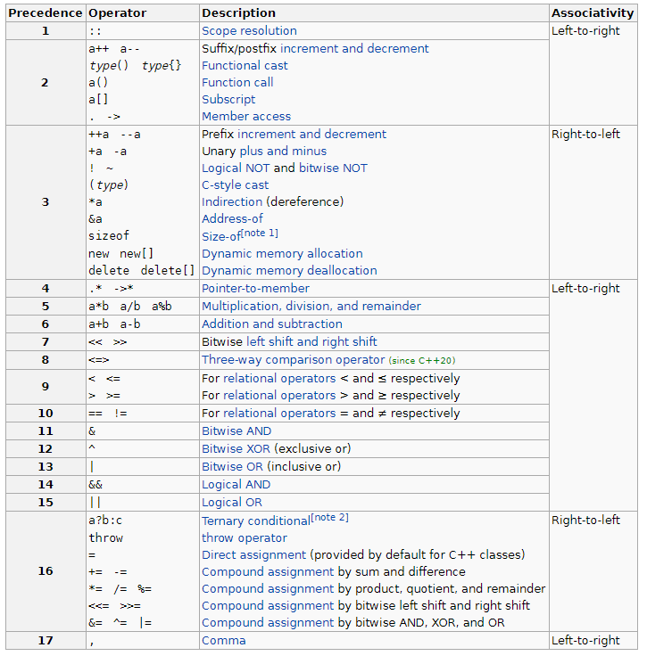

# Увод в курса по УП
- Как създаваме ние софтуер?
- Езици за програмиране
- Защо C++?

# Увод в C++
## Изход на конзолата
По-общо: ```cout << <обект>;```

Нека напишем първата си програма.
```c++
#include <iostream>

using namespace std;

int main()
{
   cout << "Hello world!" << endl;
}
```
## Променливи
Декларация на променлива: </br> ```<тип> <име> = <стойност>;``` </br>

### Примитивни типове данни
<table>
  <tr>
    <th>Име на типа</th>
    <th>Допустими стойности</th>
  </tr>
  <tr><td>char</td><td>$[-2^{7};\:2^{7}-1\:]$</td></tr>
  <tr><td>short</td><td>$[-2^{15};\:2^{15}-1\:]$</td></tr>
  <tr><td>int</td><td>$[-2^{31};\:2^{31}-1\:]$</td></tr>
  <tr><td>long long</td><td>$[-2^{63};\:2^{63}-1\:]$</td></tr>
  <tr><td>bool</td><td>$\{\:0;\:1\:\}$</td></tr>
  <tr><td>unsigned char</td><td>$[\: 0;\:2^{8}-1\:]$</td></tr>
  <tr><td>unsigned short</td><td>$[\: 0;\:2^{16}-1\:]$</td></tr>
  <tr><td>unsigned int</td><td>$[\: 0;\:2^{32}-1\:]$</td></tr>
  <tr><td>unsigned long long</td><td>$[\: 0;\:2^{64}-1\:]$</td></tr>
</table>

## Преобразуване между типовете
Има два варианта за преобразуване между типовете:
- със загуба на информация
```c++
int a = 16;
bool b = a; // true
```
```c++
double a = 6.0221;
int b = a; // 6
```
- без загуба на информация
```c++
bool b = true;
int a = b; // 1
```
```c++
int b = 6;
double a = b; // 6.0
```
## Оператори
### Характеристики
Всеки оператор се характеризира със следните свойства:
- асоциативност
  - лява
  - дясна
- приоритет
- брой аргументи (операнди)
  - унарни (с 1 аргумент) +, -, *, !, ++, --
  - бинарни (с 2 аргумента) +, -, *, /, %, всички за сравнение, &&, ||, всички за присвояване
  - тернарен (с 3 аргумента) ще бъде разгледан по-напред в курса
- позиция спрямо аргументите (операндите) си
  - префиксен
  - инфиксен
  - суфиксен
### Видове оператори
<table>
  <tr>
    <td><strong>Аритметични</strong></td>
    <td>+, -, *, /, %, ++, --</td>
  </tr>
  <tr>
    <td><strong>Оператори за сравнение</strong></td>
    <td><, <=, >, >=, ==, !=</td>
  </tr>
  <tr>
    <td><strong>Логически</strong></td>
    <td>&&, ||, !</td>
  </tr>
  <tr>
    <td><strong>Оператори за присвояване</strong></td>
    <td>=, +=, -=, *=, /=, %=</td>
  </tr>
</table>

### Приоритети и асоциативност


## Задачи
### Примери от семинар
**1.** Напишете програма, която чете число от конзолата и принтира 1, ако числото е четно, и 0, ако числото не е четно. </br>
<table>
   <tr><th><strong>Вход</strong></th><th><strong>Изход</strong></th></tr>
   <tr><td>4</td><td><i>1</i></td></tr>
   <tr><td>5</td><td><i>0</i></td></tr>
</table>

**2.** Напишете програма, която чете символ от конзолата и принтира 1, ако символът е гласна латинска буква, и 0, ако не е. </br>
<table>
   <tr><th><strong>Вход</strong></th><th><strong>Изход</strong></th></tr>
   <tr><td>A</td><td><i>1</i></td></tr>
   <tr><td>e</td><td><i>1</i></td></tr>
   <tr><td>k</td><td><i>0</i></td></tr>
   <tr><td>{</td><td><i>0</i></td></tr>
</table>

**3.** Напишете програма, която чете две цели числа от конзолата и принтира по-голямото от двете. </br>
<table>
   <tr><th><strong>Вход</strong></th><th><strong>Изход</strong></th></tr>
   <tr><td>3 </br> 4</td><td><i>4</i></td></tr>
   <tr><td>12 </br> 5</td><td><i>12</i></td></tr>
</table>

### Още задачи
**1.** Напишете програма, която чете ***трицифрено*** число от конзолата и го принтира обърнато и събрано с единица. </br>
<table>
   <tr><th><strong>Вход</strong></th><th><strong>Изход</strong></th></tr>
   <tr><td>378</td><td><i>874</i></td></tr>
   <tr><td>936</td><td><i>640</i></td></tr>
</table>

**2.** Напишете програма, която чете две цели числа и разменя стойностите им. </br>
<table>
   <tr><th><strong>Вход</strong></th><th><strong>Изход</strong></th></tr>
   <tr><td>3 </br> 4</td><td><i>4 </br> 3</i></td></tr>
   <tr><td>12 </br> 5</td><td><i>5 </br> 12</i></td></tr>
</table>

***Бонус:*** Опитайте да размените стойностите на двете променливи без да ползвате допълнителна променлива. </br>
