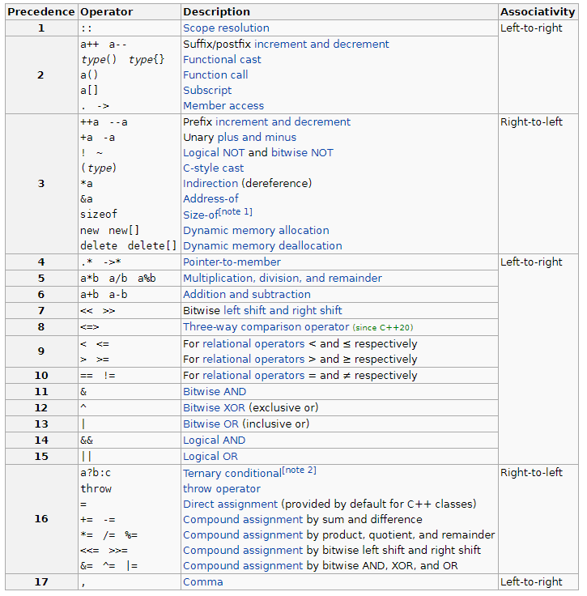

# Увод в курса по УП
- Как създаваме ние софтуер?
- Езици за програмиране
- Защо C++?

# Увод в C++
## Изход на конзолата
По-общо: ```std::cout << <обект>;```

Нека напишем първата си програма.
```c++
#include <iostream>

int main() {
   std::cout << "Hello world!" << std::endl;
}
```
## Променливи
Декларация на променлива: </br> ```<тип> <име> = <стойност>;``` </br>

### Примитивни типове данни
Тип данни наричаме дадено множество от допустими стойности и операции над тях. Например, бихме казали, че множеството на естествените числа ($`\mathbb{N}`$) е тип данни със следните дефинирани операции върху него - събиране, изваждане, умножение, деление, деление с остатък.

В C++ основните (примитивните) типове данни се делят на два вида:
- целочислени
  - цели числа - *short*, *int*, *long long* 
  - символ - *char* - описва символ от [ASCII](https://www.asciitable.com/) таблицата
  - булев тип - *bool* - може да приема стойности 0 (лъжа/false) и 1 (истина/true)
- типове с плаваща запетая (описват реални числа) - *float*, *double*

<table>
  <tr>
    <th>Име на типа</th>
    <th>Допустими стойности</th>
  </tr>
  <tr><td>char</td><td>$[-2^{7};\:2^{7}-1\:]$</td></tr>
  <tr><td>short</td><td>$[-2^{15};\:2^{15}-1\:]$</td></tr>
  <tr><td>int</td><td>$[-2^{31};\:2^{31}-1\:]$</td></tr>
  <tr><td>long long</td><td>$[-2^{63};\:2^{63}-1\:]$</td></tr>
  <tr><td>bool</td><td>$\{\:0;\:1\:\}$</td></tr>
  <tr><td>unsigned char</td><td>$[\: 0;\:2^{8}-1\:]$</td></tr>
  <tr><td>unsigned short</td><td>$[\: 0;\:2^{16}-1\:]$</td></tr>
  <tr><td>unsigned int</td><td>$[\: 0;\:2^{32}-1\:]$</td></tr>
  <tr><td>unsigned long long</td><td>$[\: 0;\:2^{64}-1\:]$</td></tr>
</table>

#### Символи
Както видяхме по-горе, типът *char* е целочислен, въпреки че описва символ. Компютрите на ниско ниво съхраняват само числа и съответно концепцията за символ или буква не съществува. </br>

Решението на този проблем е така наречената *кодировка* (*character encoding*), което представлява определено съответствие между символи и числа - за всеки възможен символ съответства единствено цяло число, като в паметта символите се представят използвайки стойностите от тази кодировка. </br>

Една популярна кодировка е [ASCII](https://www.asciitable.com/). В нея например на символа '{' съответства числото 123, тоест ако искаме да съхраним променлива от тип *char* със стойност '{', в действителност в паметта, заделена за дадената променлива, ще се пази числото 123. 
```c++
char c = '{';
// в паметта за променливата c ще се съхранява стойността 123, понеже тя кореспондира на символа '{'
std::cout << c;
// вижда се, че променливата, чиято стойност искаме да принтираме, е от тип char и затова ще се принтира самият символ, вместо числото 123
```

## Преобразуване между типовете
Има два варианта за преобразуване между типовете:
- със загуба на информация
```c++
int a = 1000;
char b = a; // ???
```
```c++
double a = 6.0221;
int b = a; // 6
```
- без загуба на информация
```c++
bool b = true;
int a = b; // 1
```
```c++
int b = 6;
double a = b; // 6.0
```
### Относно преобразуването към bool
Когато преобразуваме който и да е тип към bool, резултатът ще бъде:
- *true*, ако оригиналната стойност е нещо различно от 0
- *false*, ако оригиналната стойност е 0
```c++
int a = 16;
bool b = a; // true

int c = 0;
bool d = c; // false
```

## Оператори
### Характеристики
Всеки оператор се характеризира със следните свойства:
- асоциативност
  - лява
  - дясна
- приоритет
- брой аргументи (операнди)
  - унарни (с 1 аргумент) +, -, *, !, ++, --
  - бинарни (с 2 аргумента) +, -, *, /, %, всички за сравнение, &&, ||, всички за присвояване
  - тернарен (с 3 аргумента) ще бъде разгледан по-напред в курса
- позиция спрямо аргументите (операндите) си
  - префиксен (++a, -a)
  - инфиксен (a+b, a-b)
  - суфиксен (a++, a--)
### Видове оператори
<table>
  <tr>
    <td><strong>Аритметични</strong></td>
    <td>+, -, *, /, %, ++, --</td>
  </tr>
  <tr>
    <td><strong>Оператори за сравнение</strong></td>
    <td><, <=, >, >=, ==, !=</td>
  </tr>
  <tr>
    <td><strong>Логически</strong></td>
    <td>&&, ||, !</td>
  </tr>
  <tr>
    <td><strong>Оператори за присвояване</strong></td>
    <td>=, +=, -=, *=, /=, %=</td>
  </tr>
</table>
       
### Ограничения за аргументите на операторите
Аргументите на операторите могат да бъдат два вида:
- стойности
- променливи

Пример за подаване на стойност като аргумент на оператор е например изразът "1 + 2", където *1* и *2* са самите числа. Пример за подаване на променлива като аргумент на оператор е изразът "a + 2", където *a* е име на съществуваща променлива, а *2* е самото число 2. 

Някои оператори имат изискване за това какви трябва да бъдат аргументите им. Например операторите, които променят стойността на дадена променлива (като a++, ++a, a--, --a) очакват аргументът им да бъде променлива. Например:
```c++
int a = 5;
a++; // ok
10++; // грешка - 10 не е променлива, а стойност
```

### Какво връщат операторите?
Операторите връщат някакъв резултат. Например резултатът от операцията "1 + 2" ще бъде стойността 3. Подобно на това какво могат да приемат операторите, те могат да връщат стойност или променлива. Операторите, които връщат променлива са операторите за присвояване, както и префиксните варианти на операторите за инкрементация и декрементация (++a и --a). Всички останали оператори, които разгледахме досега, връщат стойност.
       
#### Относно сравнението за равенство на числа с плаваща запетая
Нека разгледаме следния пример:
```c++
int main() {
	double a = 1;
	double b = 0.1 * 10;
	double c = 0.1 + 0.1 + 0.1 + 0.1 + 0.1 + 0.1 + 0.1 + 0.1 + 0.1 + 0.1;

	std::cout << (a == c);
}
```
Тук бихме очаквали да се принтира "1", понеже двете числа очевидно са равни. Това обаче не е така - принтира се "0". Ако разгледаме стойностите на променливите, ще видим, че променливата *a* има стойност 1, а променливата *c* има стойност 0.99999999999999989 и по такъв начин те наистина са различни. Тази разлика се случва, поради начина, по който се извършват сметките с дробни числа от компютъра - при операции с тях различни остатъци се премахват и добавят и е възможно да се получи малко по-различен от очаквания резултат. [Тук](https://0.30000000000000004.com/) може да прочетете още за това.

Идва въпросът тогава как да сравняваме числа с плаваща запетая за равенство. 

По дефиниция две числа са равни, ако модулът от разликата им е 0. Тоест, $`a = b \iff |a - b| = 0`$. За дробните числа ще приемаме, че са равни, ако са много имат много близки стойности, тоест модулът от разликата им е по-малък от някакво много малко положително число. С други думи, $a = b \iff |a - b| \lt ε$, където $`ε`$ e много малко положително число (например $10^{-7}$).

```c++
int main() {
	double a = 1;
	double b = 0.1 * 10;
	double c = 0.1 + 0.1 + 0.1 + 0.1 + 0.1 + 0.1 + 0.1 + 0.1 + 0.1 + 0.1;

    double eps = 0.00000001;
	std::cout << (abs(a - c) < eps);
}
```

### Оператори за присвояване
Операторите за присвояване са бинарни оператори (с 2 аргумента), които приемат променлива вляво и променят стойността ѝ с изразът вдясно на оператора. Основният оператор за присвояване е '='. Останалите съществуват като по-съкратен запис на операции, свързани с операторът '='. Например, "a += 10" е същото като "a = a + 10"
Примери:
```c++
int a = 10;
a = 5; // стойността на променливата a се променя и става 5
// оттук нататък стойността на a e 5
a += 10; // стойността на променливата a се променя и става 15
// оттук нататък стойността на a e 15
a = a - 7; // стойността на променливата a става резултатът от израза "a - 7", тоест стойността на a става 8
// оттук нататък стойността на a e 8
```

### Приоритети и асоциативност


#### Промяна на приоритета
Подобно на операциите в математиката, можем да променяме приоритета на дадени операции, използвайки скоби. Например в израза "a * b + c" първо се изпълнява умножението, а после делението, но ако сложим скоби така: "a * (b + c)", първо ще се изпълни събирането в скобите и след това ще се извърши умножението.

#### Принтиране на изрази със сравнение
Нека опитаме да изпълним следния код:
```c++
#include <iostream>

int main() {
	int a = 2;
	int b = 3;
	std::cout << a > b;
}
```
Компилацията завършва с грешка. Грешката идва от това, че в C++ (за разлика от останалите езици) изходът на конзолата не става използвайки функция (като например Console.WriteLine(...) в C# или print(...) в Python), а вместо това директно се използват така наречените потоци. Тоест в случая на C++ кодът "std::cout << a;" означава "изпрати стойността на променливата a към потока std::cout" и след като през потокът премине дадената стойност, тя се визуализира на конзолата. Записването в поток става чрез оператора <<, който приема вляво поток, вдясно стойност или променлива и връща самия поток. 

В изразът "std::cout << a > b;" имаме две операции (изпращането по потока и сравнението) като поглеждайки в таблицата с приоритетите на операциите по-горе можем да видим, че първо ще се изпълни "std::cout << a", а след това сравнението. Резултатът от първата операция е самия поток и в крайна сметка ще се опитаме да сравним дали потокът std::cout е по-голям от някакво число (което е грешно, понеже операторите за сравнение не са дефинирани за поток от едната страна и за число от другата). 

За да направим верен кода по-горе, можем да сложим скоби, за да променим приоритета на операциите:
```c++
#include <iostream>

int main() {
	int a = 2;
	int b = 3;
	std::cout << (a > b);
}
```
По такъв начин първо ще се изпълни сравнението на стойностите на променливите a и b и чак след това ще се изпълни принтирането на конзолата.

## Задачи
### Примери от семинар
**1.** Напишете програма, която чете число от конзолата и принтира 1, ако числото е четно, и 0, ако числото не е четно. </br>
<table>
   <tr><th><strong>Вход</strong></th><th><strong>Изход</strong></th></tr>
   <tr><td>4</td><td><i>1</i></td></tr>
   <tr><td>5</td><td><i>0</i></td></tr>
</table>

**2.** Напишете програма, която чете символ от конзолата и принтира 1, ако символът е гласна латинска буква, и 0, ако не е. </br>
<table>
   <tr><th><strong>Вход</strong></th><th><strong>Изход</strong></th></tr>
   <tr><td>A</td><td><i>1</i></td></tr>
   <tr><td>e</td><td><i>1</i></td></tr>
   <tr><td>k</td><td><i>0</i></td></tr>
   <tr><td>{</td><td><i>0</i></td></tr>
</table>

**3.** Напишете програма, която чете две цели числа от конзолата и принтира по-голямото от двете. </br>
<table>
   <tr><th><strong>Вход</strong></th><th><strong>Изход</strong></th></tr>
   <tr><td>3 </br> 4</td><td><i>4</i></td></tr>
   <tr><td>12 </br> 5</td><td><i>12</i></td></tr>
</table>

### Още задачи
**1.** Напишете програма, която чете ***трицифрено*** число от конзолата и го принтира обърнато и събрано с единица. </br>
<table>
   <tr><th><strong>Вход</strong></th><th><strong>Изход</strong></th></tr>
   <tr><td>378</td><td><i>874</i></td></tr>
   <tr><td>936</td><td><i>640</i></td></tr>
</table>

**2.** Напишете програма, която чете две цели числа и разменя стойностите им. </br>
<table>
   <tr><th><strong>Вход</strong></th><th><strong>Изход</strong></th></tr>
   <tr><td>3 </br> 4</td><td><i>4 </br> 3</i></td></tr>
   <tr><td>12 </br> 5</td><td><i>5 </br> 12</i></td></tr>
</table>

***Бонус:*** Опитайте да размените стойностите на двете променливи без да ползвате допълнителна променлива. </br>
