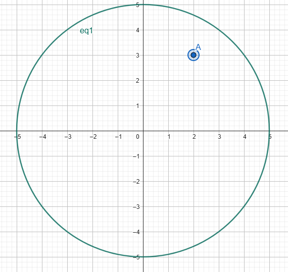
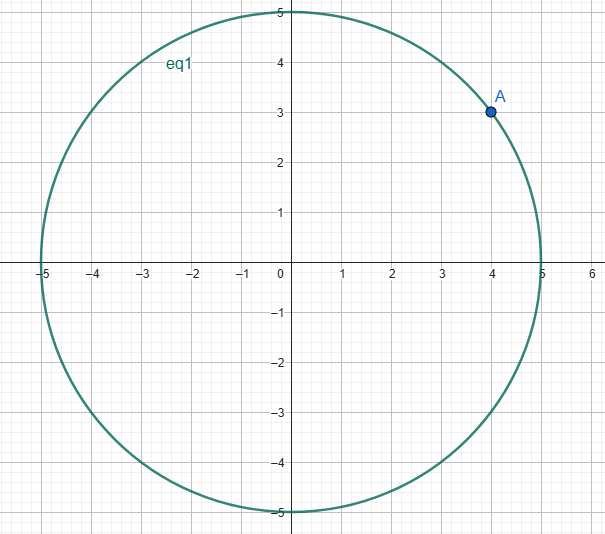
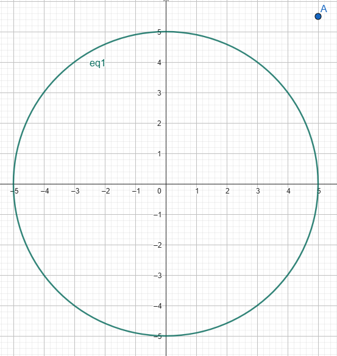

# Условни конструкции
Когато пишем дадена програма е доста удобно да изпълним дадено парче код при някакво условие и друго парче код при друго условие. 
Нека си представим, че искаме да решим следната задача: </br></br>
*Въвежда се число X. Ако то е положително - умножи го по 10 и го принтирай, а ако е отрицателно - принтирай някаква грешка.* </br> </br>
Напълно интуитивно, решението би било нещо от сорта: </br>
```c++
ако X > 0, то x *= 10 и cout << x;
иначе, cout << "error";
``` 

В С++ съществуват такива средства за изпълнение на различни парчета код в зависимост от дадено условие и те се наричат **условни конструкции**. 
### If-else
Синтаксис: 
```c++
if (<условие>)
{
    // кодът тук ще изпълни, ако условието е истина
}
else
{
    // кодът тук ще се изпълни, ако условието е лъжа
}
```
***else блокът може да бъде само един и не е задължителен, тоест може и да се пропусне***
### If-else if-else
Синтаксис: 
```c++
if (<условие1>)
{
    // кодът тук ще изпълни, ако условието е истина
}
else if (<условие2>)
{
    // кодът тук ще се изпълни, ако условие1 е лъжа, а условие2 е истина
}
else
{
    // кодът тук ще се изпълни, ако условие1 е лъжа и условие2 е лъжа
}
```
***else блокът и else-if блоковете не са задължителни, тоест може и да се пропуснат***
### Switch statement
Синтаксис: 
```c++
switch (<целочислена стойност или променлива>)
{
    case value1:
        код1;
    break;
    case value2:
        код2;
    break;
    case value3:
        код3;
    break;
    default:
        кодN;
    break;
}
```
*под "целочислена стойност или променлива" се има предвид стойност или променлива от тип char, short, int, long long, unsigned вариантите им и bool* </br>

***код1 ще се изпълни, ако стойността на целочислената променлива е равна на value1, код2 ще се изпълни, ако стойността на целочислената променлива е равна на value2 и т.н.*** </br>

***default-ът не е задължителен. В него ще се влезе, ако променливата няма нито една от изредените стойности value1, value2, value3, ...***
### Тернарен оператор
Синтаксис: 
```c++
<условие> ? <израз1> : <израз2>
```
***Тернарният оператор ще върне оценката на израз1, ако условието е истина. Оценката на израз2 ще се върне, ако условието е лъжа.***
## Задачи
### Примери от семинар
**1.** Напишете програма, която чете две цели числа от конзолата и принтира по-голямото от двете.</br>
<table>
   <tr><th><strong>Вход</strong></th><th><strong>Изход</strong></th></tr>
   <tr><td>3 </br> 4</td><td><i>4</i></td></tr>
   <tr><td>12 </br> 5</td><td><i>12</i></td></tr>
</table>

**2.** Напишете програма, която чете две цели числа $a$ и $b$ и принтира дали $a$ се дели на $b$.</br>
<table>
   <tr><th><strong>Вход</strong></th><th><strong>Изход</strong></th></tr>
   <tr><td>12 </br> 4</td><td><i>yes</i></td></tr>
   <tr><td>12 </br> 5</td><td><i>no</i></td></tr>
</table>

**3.** Напишете програма, която чете цяло число от конзолата и принтира дали то е по-малко от 100, между 100 и 200 или по-голямо от 200.</br>
<table>
   <tr><th><strong>Вход</strong></th><th><strong>Изход</strong></th></tr>
   <tr><td>98 </br></td> <td>Less than 100</td></tr>
   <tr><td>123 </br></td> <td>Between 100 and 200</td></tr>
   <tr><td>201 </br></td> <td>Greater than 200</td></tr>
</table>

**4.** Напишете програма, която чете цяло число от конзолата. Ако то е между 1 и 7, нека се принтира съответния ден от седмицата. Ако пък числото е извън този диапазон, нека се принтира подходящо съобщение.
<table>
   <tr><th><strong>Вход</strong></th><th><strong>Изход</strong></th></tr>
   <tr><td>1</td> <td>Monday</td></tr>
   <tr><td>7</td> <td>Sunday</td></tr>
    <tr><td>8</td> <td>Invalid day!</td></tr>
    <tr><td>0</td> <td>Invalid day!</td></tr>
</table>

### Още задачи
**1.** Напишете програма, която представлява прост калкулатор, поддържащ следните двуместни операции:
<table>
   <tr><th><strong>Операция</strong></th><th><strong>Символ</strong></th></tr>
   <tr><td>събиране </br></td> <td><i>+</i></td></tr>
   <tr><td>изваждане </br></td> <td><i>-</i></td></tr>
   <tr><td>умножение </br></td> <td><i>*</i></td></tr>
   <tr><td>деление </br></td> <td><i>/</i></td></tr>
</table>

Потребителят трябва да въведе 2 числа и след това знакът на съответната операция. </br>
<table>
   <tr><th><strong>Вход</strong></th><th><strong>Изход</strong></th></tr>
   <tr><td>2 3  +</td> <td>5</td></tr>
   <tr><td>3  5  /</td> <td>0.6</td></tr>
    <tr><td>-5  8  -</td> <td>-13</td></tr>
</table>

*Иначе защо точно в този ред?*
</br>
Може би се наложи да приемате входа по точно този начин, за да видите, че съществуват и други начини за записване на математически изрази. Един от тях е така нареченият *Обратен полски запис*.
Обратният полски запис е начин на записване, при който операторът се поставя след аргументите, а не между тях.
| Вид запис  | Пример |
| ---------  |:------:|
| префиксен (полски)   | + 2 3      |
| инфиксен  | 2 + 3      |
| постфиксен (обратен полски)  | 2 3 +      |

В сравнение с алгебричната нотация (инфиксния запис), обратният полски запис води до по-бързи изчисления, защото не е нужно изразите в обратен полски запис да бъдат скобувани, защото редът на операциите е същият като реда на знаците в израза. Например изразът ```(1 + 2) * (3 + 4)``` в обратен полски запис става ```1 2 + 3 4 + *```,
като първо ще се съберат числата *1* и *2*, след това ще се съберат числата *3* и *4* и накрая резултатите от двата израза ще се умножат.
</br></br>
**2.** Напишете програма, която приема час и минути от 24-часово време и принтира часът и минутите след 15 минути. Часовете и минутите да се изписват винаги с 2 цифри, като при нужда да се добавя водеща нула</br>
<table>
   <tr><th><strong>Вход</strong></th><th><strong>Изход</strong></th></tr>
   <tr><td>23 55</td> <td>00:10</td></tr>
   <tr><td>2 43</td> <td>02:58</td></tr>
</table>

**3.** Напишете програма, която приема радиус и координати на точка в Декартова координатна система и проверява дали точката се намира вътре, извън или по контура на окръжност с център (0,0).</br>
<table>
   <tr><th><strong>Вход</strong></th><th><strong>Изход</strong></th><th><strong>Обяснение</strong></th></tr>
   <tr><td>5 2 3</td> <td>inside</td><td></td></tr>
   <tr><td>5 4 3</td> <td>on the circle</td><td></td></tr>
    <tr><td>5 5 5.5</td> <td>outside</td><td></td></tr>
</table>
